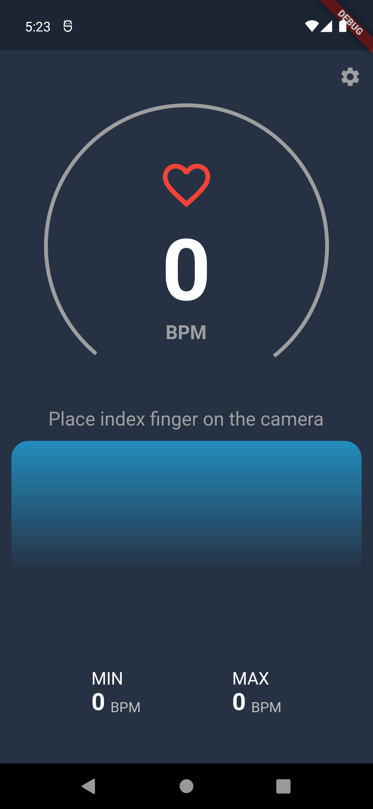
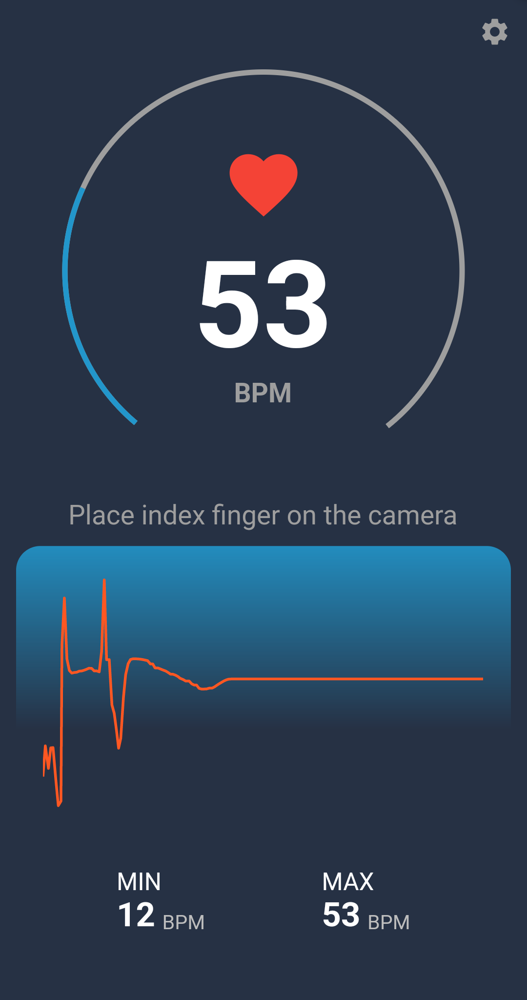
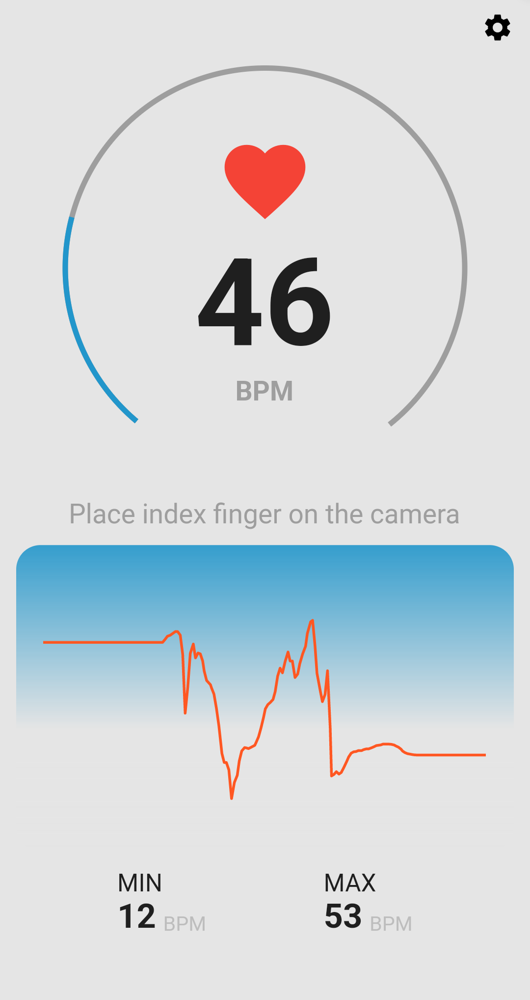
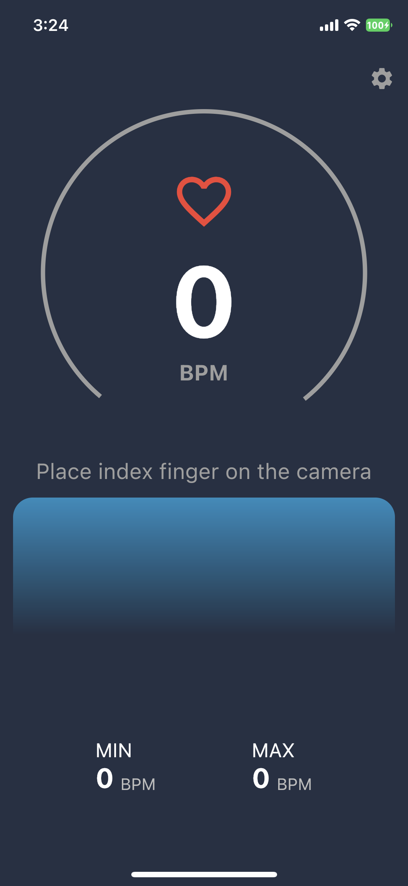
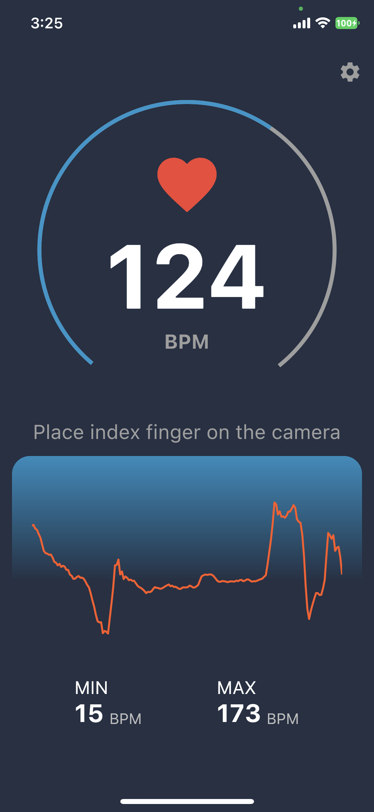
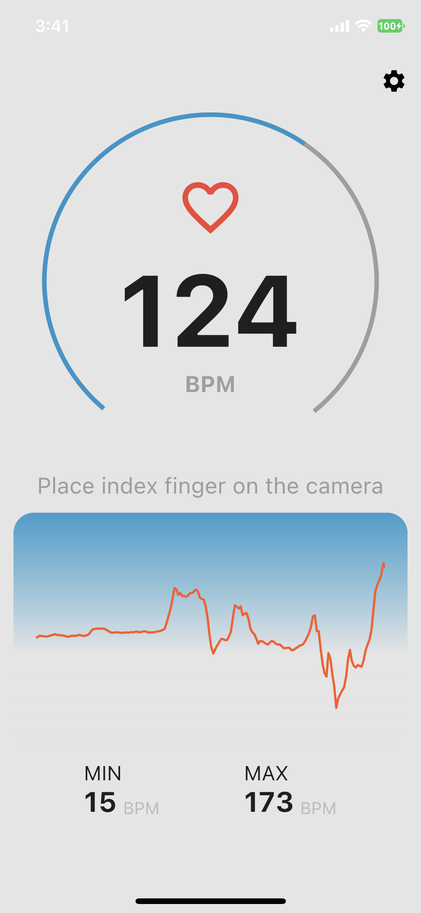

# Pulse_Rate_Monitor❤️
A app based heart rate monitor that measures pulse from the fingertip using phone's camera and its flash.

---

## Screenshots
<table>
  <tr>
    <td>Home screen</td>
     <td>Monitoring</td>
     <td>Light Theme</td>
  </tr>
  <tr>
    <td></td>
    <td></td>
    <td></td>
  </tr>
  <tr>
    <td></td>
    <td></td>
    <td></td>
  </tr>
 </table>

---

## How to use it
First place your finger on the device so that it covers both the flash and the camera. The flash should turn on during the measurement. Try to keep your finger as stable as possible because even small movements will disrupt the measurement. The BPM reading should be accurate when the graph looks stable as shown in the screenshot above.

---

## User Installation

To build this project:

- Fork this repo
- Clone or download the forked repo to start working

To learn how to fork and clone repos on github, you can visit this [Link](https://docs.github.com/en/get-started/quickstart/fork-a-repo)

---

Credits:
[Afonsocraposo](https://github.com/Afonsocraposo)
[Mufeeda Patel](https://github.com/mufida1018)

