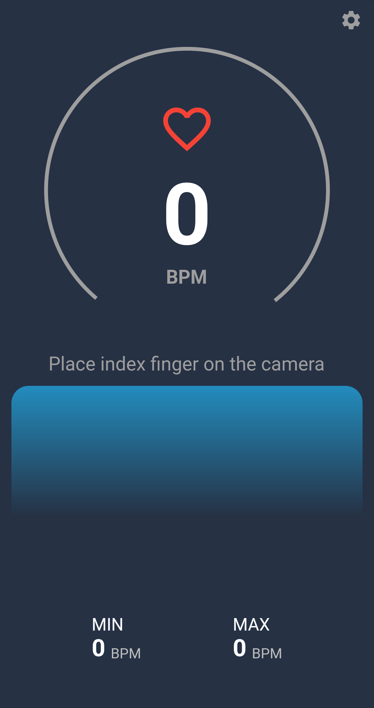

# pulse_rate_monitor

Application that measures the pulse rate using the phone's camera and its flash.

# Screenshots
<table>
  <tr>
    <td>Home screen</td>
     <td>Monitoring</td>
  </tr>
  <tr>
    <td></td>
    <td></td>
    <td></td>
    </tr>
 </table>

Credits:
[Afonsocraposo](https://github.com/Afonsocraposo)
